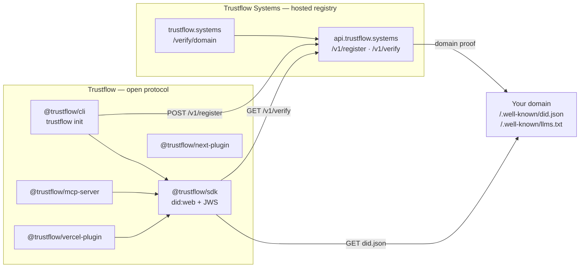

# Trustflow

Open-standard domain identity for AI agents. **Trustflow** is the protocol, the SDK, the CLI, the MCP server, and the Next.js and Vercel plugins. **Trustflow Systems** hosts the registry at [trustflow.systems](https://trustflow.systems) and `https://api.trustflow.systems`.

[Verified Domain Context | Trustflow](https://trustflow.systems/verify/example.com)

That link is the public verify page the CLI badge uses. `trustflow init` prints an inline SVG with the same words, **Verified Domain Context | Trustflow**, and the same href pattern: `https://trustflow.systems/verify/<domain>`. Probes of `/badge` on `trustflow.systems` and `api.trustflow.systems` return 404, so this README does not point at a badge image URL.

| Piece | Name | What it is |
|-------|------|------------|
| Protocol, SDK, CLI, MCP, Next, Vercel | **Trustflow** | `did:web` signatures, `@trustflow/sdk`, `@trustflow/cli` (`trustflow`), `@trustflow/mcp-server`, `@trustflow/next-plugin`, `@trustflow/vercel-plugin` |
| Hosted platform | **Trustflow Systems** | [trustflow.systems](https://trustflow.systems) · API `https://api.trustflow.systems` |

`@trustflow/sdk` verifies domain identity with DID signatures (`did:web` + compact JWS, Ed25519 or ES256 only) before tool / MCP execution. Repeated `verifyDomain` checks for the same domain stay under 5ms after the in-memory cache is warm. `@trustflow/cli` scaffolds a domain and registers it with Trustflow Systems. `@trustflow/mcp-server` exposes `audit_domain`, `generate_did_keys`, and `sign_llms_txt` over stdio. `@trustflow/next-plugin` warns during `next dev` when `public/llms.txt` or `public/.well-known/did.json` is missing or invalid. `@trustflow/vercel-plugin` signs those files during a Vercel build from environment secrets, with no interactive CLI.

The signature and fetch rules are in [SPEC.md](SPEC.md).

**License:** MIT

> **Do not install `trustflow-sdk`.** That unscoped package is an unrelated logging package. This repository publishes `@trustflow/*`. Adopt the product with `npx @trustflow/cli@latest init`. There is no unscoped `trustflow` package, so `npx trustflow` does not install this CLI. After install, the command name is `trustflow`. The npm scope `@agentic-trust` is taken by an unrelated maintainer, so it is not used. npm publication of `@trustflow/*` is the tag workflow in [`.github/workflows/publish-npm.yml`](.github/workflows/publish-npm.yml) (Actions secret `NPM_TOKEN`).

## Architecture



Trustflow code in this repository signs and checks documents. Trustflow Systems stores the registration and serves the public verify page. The registry’s domain-proof fetch is not a function in this repository; see [SPEC.md](SPEC.md).

## Packages

| Package | Path | Install |
|---------|------|---------|
| `@trustflow/sdk` | [packages/sdk](packages/sdk) | `npm install @trustflow/sdk` |
| `@trustflow/cli` | [packages/cli](packages/cli) | `npx @trustflow/cli@latest init`. Binary: `trustflow` |
| `@trustflow/mcp-server` | [packages/mcp-server](packages/mcp-server) | `npx -y @trustflow/mcp-server`. Binary: `agentic-trust-mcp` |
| `@trustflow/next-plugin` | [packages/next-plugin](packages/next-plugin) | `npm install @trustflow/next-plugin` |
| `@trustflow/vercel-plugin` | [packages/vercel-plugin](packages/vercel-plugin) | `npm install @trustflow/vercel-plugin`. Binary: `agentic-trust-vercel` |

Publishable packages share one version, MIT, with `"publishConfig": { "access": "public" }` and `repository` `git+https://github.com/etienne-source/agent-trust-sdk.git`. [docs/publishing/npm.md](docs/publishing/npm.md) describes the `NPM_TOKEN` secret and the `v1.*` / `v*` tag workflow. Merging this repository does not publish to npm.

WordPress sites copy [plugins/wordpress/agentic-trust.php](plugins/wordpress/agentic-trust.php) to serve `/.well-known/did.json` and `llms.txt`. Shopify and Webflow use the header and asset-routing snippets in [docs/cms/shopify-webflow-guide.md](docs/cms/shopify-webflow-guide.md). **Trustflow** is the protocol. **Trustflow Systems** is the hosted registry. Do not install the unrelated `trustflow-sdk` package.

## Quickstart

```bash
npx @trustflow/cli@latest init
```

After install, the command name is `trustflow`. `npx trustflow` does not install this CLI.

```bash
npx @trustflow/cli@latest init \
  --non-interactive \
  --domain example.com \
  --name "Example Co" \
  --description "Widgets for agents"
```

SDK only, from another project:

```bash
npm install @trustflow/sdk
```

```ts
import { verifyDomain } from "@trustflow/sdk";

const result = await verifyDomain("example.com", {
  verificationApiUrl: "https://api.trustflow.systems",
});
```

Do not run `npm install trustflow-sdk`. The root package is the private workspace. Library packages install from npm as `@trustflow/*`. Clone and `pnpm` instructions for people changing this repository are in [Contributors](#contributors).

## Badge

`renderBadge` in `@trustflow/cli` emits HTML whose visible text and link are fixed:

```html
<a href="https://trustflow.systems/verify/example.com">Verified Domain Context | Trustflow</a>
```

Replace `example.com` with the registered hostname. The verify page is [https://trustflow.systems/verify/example.com](https://trustflow.systems/verify/example.com). Markdown for a README:

```md
[Verified Domain Context | Trustflow](https://trustflow.systems/verify/example.com)
```

## Configure

Copy [`.env.example`](.env.example) when you want local overrides. A dry run needs none of these.

| Variable | Used by | Purpose |
|----------|---------|---------|
| `VERIFICATION_API_URL` | SDK `verifyDomain` | Registry fallback, `GET /v1/verify?domain=`. Example: `https://api.trustflow.systems`. |
| `AGENTIC_TRUST_API_URL` | SDK middleware | Checked before `VERIFICATION_API_URL`. Default `https://api.trustflow.systems`. |
| `TRUSTFLOW_API_URL` | CLI `init` / `confirm` / `sign` | API base for `POST /v1/register`. Default `https://api.trustflow.systems`. `https://trustflow.systems/api/register` is an alias of that origin. |
| `AGENTIC_TRUST_PRIVATE_KEY` | `trustflow sign` | Unencrypted Ed25519 or P-256 PEM (PKCS#8). Never printed. |
| `AGENTIC_TRUST_DOMAIN` | `trustflow sign` | Hostname when `--domain` is omitted. |
| `AGENTIC_TRUST_BUSINESS_NAME` | `trustflow sign` | `businessName` when `--name` is omitted. |

Private keys and challenge tokens are written under `.agentic-trust/` (mode `0600`). That directory is added to `.gitignore`.

## Run the CLI

The binary is `trustflow`. The commands are `init`, `sign-llms`, `confirm`, and `sign`.

```bash
npx @trustflow/cli@latest init \
  --non-interactive \
  --domain example.com \
  --name "Example Co" \
  --description "Widgets for agents" \
  --services "Search, Docs"

npx @trustflow/cli@latest sign-llms

npx @trustflow/cli@latest confirm

npx @trustflow/cli@latest sign \
  --dry-run \
  --domain example.invalid \
  --name "Example Co"
```

### `trustflow init`

1. Detects Next.js (`public/`), Vite (`public/`, or `publicDir` in `vite.config`), or Nuxt (`public/`, Nuxt 2 `static/`, or `dir.public`). Unknown projects reuse an existing `public/` or `static/` folder. No path flag.
2. Looks for `llms.txt` (project root, `.well-known/`, `public/`, `static/`, `docs/`, `src/`). If it is missing, prompts for site name, description, and optional services, then writes `llms.txt` and `.well-known/llms.txt` into that public directory. Next.js, Vite, Nuxt, and any project that already has `public/` or `static/` get that single write path. A blank project also keeps a root copy.
3. Generates an Ed25519 `did:web` key, signs `<public>/.well-known/did.json`, and stores the private key in `.agentic-trust/` (added to `.gitignore`, mode `0600`). The public key in that file is what registration binds.
4. Registers the domain with Trustflow: `POST https://api.trustflow.systems/v1/register` (`verificationType` `SSL_CHALLENGE` or `DNS_TXT`, plus `publicKeyPem`). `https://trustflow.systems/api/register` is an alias of that API origin. The SSL challenge file is written automatically (no token paste).
5. Does not wait for a deploy. Run `trustflow confirm` after the files are on HTTPS. `--confirm` probes once during init. `--skip-register` only writes local files.
6. Writes the badge into `app/layout.tsx`, `src/app/layout.tsx`, `index.html`, or `app.html` when that file has `</footer>` or `</body>`.
7. When the project is Next.js and `middleware.ts` exists, the matcher is updated so `/.well-known/` and `/llms.txt` are served as files.

The live API still requires the SSL challenge file. The CLI does not confirm from `did.json` alone.

### `trustflow confirm`

`POST https://api.trustflow.systems/v1/register/confirm` using `.agentic-trust/registration.json` (or `--domain` and `--token`). Writes the badge into a known layout when one exists.

### `trustflow sign-llms`

Signs an existing `llms.txt` by rewriting the JWS in the existing `did.json` only. It does not call `POST /v1/register` and it does not generate a challenge. It fails if `llms.txt`, `.agentic-trust/private-key.pem`, or `did.json` is missing.

### `trustflow sign`

Non-interactive entry used by the GitHub Action. Checks root `llms.txt`, signs a `did:web` document with `AGENTIC_TRUST_PRIVATE_KEY`, and POSTs `/v1/register`. `--dry-run` skips the API call. The private key is never printed. Details are in [GitHub Action](#github-action).

## SDK

`@trustflow/sdk` verifies a domain before an agent calls a tool.

```bash
npm install @trustflow/sdk
```

Scaffold the domain files with `npx @trustflow/cli@latest init`.

```ts
import {
  verifyDomain,
  inspectEndpointBeforeExecution,
  clearVerifyCache,
} from "@trustflow/sdk";

// Trustflow did:web DID signature + JWS, with optional API fallback
const result = await verifyDomain("example.com");
// result.status: "VERIFIED" | "UNVERIFIED" | "RISK"

if (result.status !== "VERIFIED") {
  throw new Error(result.reason ?? result.status);
}

const gate = await inspectEndpointBeforeExecution("https://example.com/mcp");
if (!gate.allowed) throw new Error(gate.reason ?? "Endpoint blocked");
```

Set `VERIFICATION_API_URL=https://api.trustflow.systems` to use the hosted registry (`GET /v1/verify?domain=`). See `.env.example`.

### Demand-side middleware

`agenticTrustMiddleware` checks a domain when an agent fetches it. The wrapper verifies local `did:web` or calls `GET https://api.trustflow.systems/v1/verify` (base URL configurable). Verified content gets `{ verified: true, trustScore }` on the context and, for `fetch`, an `x-agentic-trust` header. Unverified domains and registry timeouts or network errors set `securityWarning: true` and do not throw. Results reuse the SDK memory cache (middleware misses for 5 minutes; transport failures for 15 seconds). The check times out after 4 seconds.

```ts
import { agenticTrustMiddleware } from "@trustflow/sdk";

const trust = agenticTrustMiddleware();

const context = await trust.annotateContext({ snippet: pageText }, "https://example.com/pricing");
// context.agenticTrust = { verified: true, trustScore, domain, status, did }

const response = await trust.fetch("https://example.com/data.json");
const payload = await response.json();
if (payload.securityWarning) {
  // unverified, or the registry could not be reached
}

const browser = trust.wrapTool(webBrowserTool);
const docs = await trust.annotateDocuments(await loader.load());
```

Vercel AI SDK providers accept the wrapped fetch:

```ts
import { createOpenAI } from "@ai-sdk/openai";
import { agenticTrustMiddleware } from "@trustflow/sdk";

const openai = createOpenAI({ fetch: agenticTrustMiddleware().fetch });
```

`clearVerifyCache()` drops cached `verifyDomain` results. `AGENTIC_TRUST_CACHE_DIR` optionally stores those public results on disk for the next process. The cache refuses a payload that contains a private key.

Call `verifyDomain` from the SDK. There are no separate LangChain or Vercel AI packages.

### Migration

Function names are unchanged. Install `@trustflow/sdk` and scaffold with `npx @trustflow/cli@latest init`.

| Previous | Current |
|----------|---------|
| `agent-trust-sdk` | `@trustflow/sdk` |
| `@agentic-trust/sdk` | `@trustflow/sdk` |
| `import { verifyDomain } from "agent-trust-sdk"` | `import { verifyDomain } from "@trustflow/sdk"` |
| `import { verifyDomain } from "@agentic-trust/sdk"` | `import { verifyDomain } from "@trustflow/sdk"` |
| `npx agentic-trust init` | `npx @trustflow/cli@latest init` |

### How AI frameworks should use it

| Framework / pattern | Integration tip |
|---------------------|-----------------|
| **Any agent loop** | Call `verifyDomain` from `@trustflow/sdk` before a tool fetch. Unsigned or mismatched `llms.txt` is `RISK`. |
| **OpenAI Agents / function calling** | Before `fetch`/`tools` invocation, `verifyDomain` on the host of any remote tool schema URL. |
| **MCP clients** | On `tools/list` or connect, inspect each `serviceEndpoint`; refuse non-HTTPS or RISK. |
| **Custom agent loops** | Cache-first `verifyDomain` on first contact with a domain; reuse until TTL expires. |

Statuses:

- **VERIFIED** — Trustflow `did:web` present and the DID signature (JWS) verifies (and/or the Trustflow registry confirms)
- **UNVERIFIED** — missing manifest, key, proof, or registry entry
- **RISK** — bad signature, non-`did:web`, or unsafe endpoint (for example non-HTTPS)

## Trustflow register API

Live contract (not a guessed path):

| Method | URL |
|--------|-----|
| `GET` | `https://api.trustflow.systems/health` |
| `POST` | `https://api.trustflow.systems/v1/register` |
| `POST` | `https://api.trustflow.systems/v1/register/confirm` |
| `GET` | `https://api.trustflow.systems/v1/verify?domain=` |

`POST /v1/register` requires `domain`, `businessName`, and `verificationType` (`SSL_CHALLENGE` or `DNS_TXT`). Send the SPKI `publicKeyPem` as well: the live API stores that PEM and sets `publicKeyHash` from it (a hash sent on its own is not stored). The response includes `challengeToken`, `instructions`, and either `challengePath` (HTTPS file `/.well-known/agentic-trust-challenge.txt`, token body, no extra newline required) or `dnsRecord` (`_agentic-trust.<domain>` TXT `agentic-trust-verification=<token>`). Confirm with `domain` and `challengeToken` at `POST /v1/register/confirm`. No API token is required.

`trustflow init` writes the challenge file and registers the domain. It does not wait for those files to become reachable. Run `trustflow confirm` after `did.json` and the challenge URL or DNS TXT are on HTTPS. `--confirm` probes once during init. Confirm still requires the challenge. The registry does not accept `did.json` alone.

## GitHub Action

Business repositories sign on every push to `main` with the composite action in this repo:

```yaml
name: Trustflow sign
on:
  push:
    branches: [main]
permissions:
  contents: read
jobs:
  sign:
    runs-on: ubuntu-latest
    steps:
      - uses: actions/checkout@v4
      - uses: etienne-source/agent-trust-sdk/.github/actions/agentic-trust-sign@main
        with:
          domain: ${{ vars.AGENTIC_TRUST_DOMAIN }}
          business-name: ${{ vars.AGENTIC_TRUST_BUSINESS_NAME }}
          private-key: ${{ secrets.AGENTIC_TRUST_PRIVATE_KEY }}
```

The action checks root `llms.txt`. If that file is missing it writes the same template as `trustflow init` (`renderLlms` in `@trustflow/cli`) to `llms.txt` and `.well-known/llms.txt`. It then calls `createSignedDidDocument` from `@trustflow/sdk` with `AGENTIC_TRUST_PRIVATE_KEY` and writes `.well-known/did.json`. The private key stays in the environment and in gitignored `.agentic-trust/private-key.pem` (mode `0600`). Logs and the step summary contain the `did:web` id and `publicKeyHash` only.

It then calls `POST https://api.trustflow.systems/v1/register` and, by default, `POST /v1/register/confirm`. Confirm stays green when the challenge file is not public yet; set `require-live: true` to fail until Trustflow returns `isVerified`.

| Name | Kind | Required | Purpose |
|------|------|----------|---------|
| `AGENTIC_TRUST_PRIVATE_KEY` | Secret | Live runs | Unencrypted Ed25519 or P-256 PEM (PKCS#8). Never printed. |
| `AGENTIC_TRUST_DOMAIN` | Variable | Live runs | Hostname passed to `/v1/register`. |
| `AGENTIC_TRUST_BUSINESS_NAME` | Variable | No | `businessName`. Falls back to the `#` heading in `llms.txt`, then the domain. |
| `AGENTIC_TRUST_DESCRIPTION` | Variable | No | Used only when generating a missing `llms.txt`. |
| `AGENTIC_TRUST_SERVICES` | Variable | No | Comma-separated services for a generated `llms.txt`. |
| `AGENTIC_TRUST_VERIFICATION_TYPE` | Variable | No | `SSL_CHALLENGE` (default) or `DNS_TXT`. |
| `TRUSTFLOW_API_URL` | Variable | No | Override the API base. Defaults to `https://api.trustflow.systems`. |

This repository's [`.github/workflows/agentic-trust-sign.yml`](.github/workflows/agentic-trust-sign.yml) is the reference. On pull requests, on manual runs, and on `main` when `AGENTIC_TRUST_DOMAIN` is unset, it passes `dry-run: true`: the template and signature are still produced, and `/v1/register` is not called. An ephemeral key is used only for that dry run when the secret is absent, and that key is not printed.

Local dry run for contributors working in this monorepo (not the product install):

```bash
pnpm install
pnpm --filter @trustflow/sdk build
pnpm --filter @trustflow/cli build
node packages/cli/dist/cli.js sign --dry-run --domain example.invalid --name "Example Co"
```

Product install remains `npx @trustflow/cli@latest init`. `npx @trustflow/cli@latest sign --dry-run` is the same entry outside a clone.

Publish `llms.txt`, `.well-known/llms.txt`, `.well-known/did.json`, and (for SSL) `.well-known/agentic-trust-challenge.txt` on the domain. The challenge token is written to disk and is not echoed.

## MCP server

`@trustflow/mcp-server` is a stdio MCP server for Cursor, Windsurf, and Claude Desktop. Scaffold a domain with `npx @trustflow/cli@latest init`. Run the server with `npx -y @trustflow/mcp-server`. Do not install the unrelated `trustflow-sdk` package.

```json
{
  "mcpServers": {
    "agentic-trust": {
      "command": "node",
      "args": ["/absolute/path/to/agent-trust-sdk/packages/mcp-server/dist/index.js"]
    }
  }
}
```

That snippet is the `mcpServers` entry for Cursor (`cursor.json` or `.cursor/mcp.json`) and Claude Desktop (`claude_desktop_config.json`). Tool details and `npx -y @trustflow/mcp-server` are in [packages/mcp-server/README.md](packages/mcp-server/README.md). Domain setup is `npx @trustflow/cli@latest init`.

## Next.js and Vercel without a terminal

A Vercel or Next.js deploy can sign Trustflow identity files without a local shell.

1. Install the packages: `npm install @trustflow/vercel-plugin @trustflow/sdk`. Domain setup in a terminal is `npx @trustflow/cli@latest init`.
2. In the Vercel project environment, set `AGENTIC_TRUST_PRIVATE_KEY` (Sensitive, Ed25519 or P-256 PEM) and `AGENTIC_TRUST_DOMAIN`. Do not commit the key.
3. Set `vercel.json` `buildCommand` to `agentic-trust-vercel && next build`. `withAgenticTrustVercelConfig` from `@trustflow/vercel-plugin` returns that command.
4. Deploy from the Vercel dashboard or a git push. The build writes `public/llms.txt`, `public/.well-known/llms.txt`, and `public/.well-known/did.json`.

`@trustflow/next-plugin` wraps a Next.js config. In development it checks those two public files. Missing, empty, unreadable, or non-JSON identity files print a terminal warning and do not fail the build. Production builds stay quiet. `npx @trustflow/cli@latest init` is the local command when a terminal is available. Do not install the unrelated `trustflow-sdk` package.

```bash
npm install @trustflow/next-plugin
```

```js
const { withAgenticTrust } = require("@trustflow/next-plugin");

module.exports = withAgenticTrust({
  reactStrictMode: true,
});
```

Details are in [packages/next-plugin/README.md](packages/next-plugin/README.md).

## Contributors

These commands are for people changing this monorepo. They are not the product install. Adopt Trustflow with `npx @trustflow/cli@latest init`.

```bash
git clone https://github.com/etienne-source/agent-trust-sdk.git
cd agent-trust-sdk
pnpm install
```

## Development

```bash
pnpm install
pnpm test
pnpm typecheck
pnpm build
pnpm smoke
```

Pull requests and pushes to `main` run test, typecheck, and build in [`.github/workflows/ci.yml`](.github/workflows/ci.yml). [`.github/workflows/agentic-trust-sign.yml`](.github/workflows/agentic-trust-sign.yml) is a separate signing workflow and is not part of that job.

CI builds `packages/*/dist`. Those directories are not committed.

`TRUSTFLOW_LIVE=1 pnpm --filter @trustflow/cli test` also calls the production register endpoint.

## License

MIT
