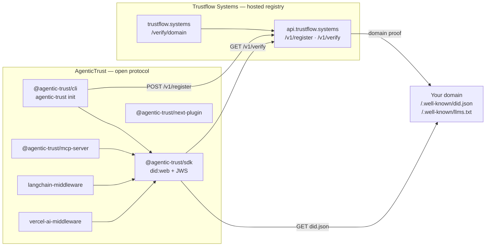

# AgenticTrust

Open-standard domain identity for AI agents. **AgenticTrust** is the protocol, the SDK, the CLI, the MCP server, the Next.js plugin, and the framework middleware. **Trustflow Systems** hosts the registry at [trustflow.systems](https://trustflow.systems) and `https://api.trustflow.systems`.

[Verified by AgenticTrust | trustflow.systems](https://trustflow.systems/verify/example.com)

That link is the public verify page the CLI badge uses. `agentic-trust init` prints an inline SVG with the same words, **Verified by AgenticTrust | trustflow.systems**, and the same href pattern: `https://trustflow.systems/verify/<domain>`. Probes of `/badge` on `trustflow.systems` and `api.trustflow.systems` return 404, so this README does not point at a badge image URL.

| Piece | Name | What it is |
|-------|------|------------|
| Protocol, SDK, CLI, MCP, Next | **AgenticTrust** | `did:web` signatures, `@agentic-trust/sdk`, `@agentic-trust/cli` (`agentic-trust`), `@agentic-trust/mcp-server`, `@agentic-trust/next-plugin` |
| Framework middleware | **AgenticTrust** | `@agentic-trust/langchain-middleware`, `@agentic-trust/vercel-ai-middleware` — reject unsigned `llms.txt` context before it is parsed |
| Hosted platform | **Trustflow Systems** | [trustflow.systems](https://trustflow.systems) · API `https://api.trustflow.systems` |

`@agentic-trust/sdk` verifies domain identity with DID signatures (`did:web` + compact JWS, Ed25519 or ES256 only) before tool / MCP execution. `@agentic-trust/cli` scaffolds a domain and registers it with Trustflow Systems. `@agentic-trust/mcp-server` exposes `audit_domain`, `generate_did_keys`, and `sign_llms_txt` over stdio. `@agentic-trust/next-plugin` warns during `next dev` when `public/llms.txt` or `public/.well-known/did.json` is missing or invalid.

The signature and fetch rules are in [SPEC.md](SPEC.md).

**License:** MIT

> **Do not install `trustflow-sdk`.** `npm install trustflow-sdk` and `npx trustflow init` point at an unrelated logging package. This repository is not that package, and the `@agentic-trust` scope is not on npm. Install from GitHub: `github:etienne-source/agent-trust-sdk`.

## Architecture



AgenticTrust code in this repository signs and checks documents. Trustflow Systems stores the registration and serves the public verify page. The registry’s domain-proof fetch is not a function in this repository; see [SPEC.md](SPEC.md).

## Packages

| Package | Path | Install |
|---------|------|---------|
| `@agentic-trust/sdk` | [packages/sdk](packages/sdk) | `pnpm add github:etienne-source/agent-trust-sdk#path:/packages/sdk` |
| `@agentic-trust/cli` | [packages/cli](packages/cli) | Clone this repo (`workspace:*` on the SDK). Binary: `agentic-trust` |
| `@agentic-trust/mcp-server` | [packages/mcp-server](packages/mcp-server) | Clone this repo. Binary: `agentic-trust-mcp` |
| `@agentic-trust/next-plugin` | [packages/next-plugin](packages/next-plugin) | `pnpm add github:etienne-source/agent-trust-sdk#path:/packages/next-plugin` |
| `@agentic-trust/langchain-middleware` | [packages/langchain-middleware](packages/langchain-middleware) | GitHub path install, plus the SDK path above |
| `@agentic-trust/vercel-ai-middleware` | [packages/vercel-ai-middleware](packages/vercel-ai-middleware) | GitHub path install, plus the SDK path above |
| Starters | [starters/](starters/README.md) | [nextjs](starters/nextjs), [v0](starters/v0), [bolt](starters/bolt). Not workspace packages. `pnpm install` inside the folder. |

## Quickstart

The command once `@agentic-trust/cli` is on npm:

```bash
npx agentic-trust init
```

That scope is not on npm yet, so `npx agentic-trust init` does not resolve from the registry today. From a clone, the same binary is:

```bash
git clone https://github.com/etienne-source/agent-trust-sdk.git
cd agent-trust-sdk
pnpm install
pnpm --filter @agentic-trust/cli exec agentic-trust init \
  --non-interactive \
  --domain example.com \
  --name "Example Co" \
  --description "Widgets for agents"
```

SDK only, from another project:

```bash
pnpm add github:etienne-source/agent-trust-sdk#path:/packages/sdk
```

```ts
import { verifyDomain } from "@agentic-trust/sdk";

const result = await verifyDomain("example.com", {
  verificationApiUrl: "https://api.trustflow.systems",
});
```

Do not run `npm install trustflow-sdk`, `npm install github:etienne-source/agent-trust-sdk` against the repository root, or `pnpm add` of `packages/cli` by itself. The root package is the private workspace. CLI, MCP, and the two middleware packages depend on `@agentic-trust/sdk` with `workspace:*`, which resolves inside this clone. `dist/` is committed, so the CLI runs after `pnpm install`.

## Badge

`renderBadge` in `@agentic-trust/cli` emits HTML whose visible text and link are fixed:

```html
<a href="https://trustflow.systems/verify/example.com">Verified by AgenticTrust | trustflow.systems</a>
```

Replace `example.com` with the registered hostname. The verify page is [https://trustflow.systems/verify/example.com](https://trustflow.systems/verify/example.com). Markdown for a README:

```md
[Verified by AgenticTrust | trustflow.systems](https://trustflow.systems/verify/example.com)
```

## Configure

Copy [`.env.example`](.env.example) when you want local overrides. A dry run needs none of these.

| Variable | Used by | Purpose |
|----------|---------|---------|
| `VERIFICATION_API_URL` | SDK `verifyDomain` | Registry fallback, `GET /v1/verify?domain=`. Example: `https://api.trustflow.systems`. |
| `AGENTIC_TRUST_API_URL` | SDK middleware | Checked before `VERIFICATION_API_URL`. Default `https://api.trustflow.systems`. |
| `TRUSTFLOW_API_URL` | CLI `init` / `confirm` / `sign` | API base for `POST /v1/register`. Default `https://api.trustflow.systems`. `https://trustflow.systems/api/register` is an alias of that origin. |
| `AGENTIC_TRUST_PRIVATE_KEY` | `agentic-trust sign` | Unencrypted Ed25519 or P-256 PEM (PKCS#8). Never printed. |
| `AGENTIC_TRUST_DOMAIN` | `agentic-trust sign` | Hostname when `--domain` is omitted. |
| `AGENTIC_TRUST_BUSINESS_NAME` | `agentic-trust sign` | `businessName` when `--name` is omitted. |

Private keys and challenge tokens are written under `.agentic-trust/` (mode `0600`). That directory is added to `.gitignore`.

## Run the CLI

The binary is `agentic-trust`. The commands are `init`, `confirm`, and `sign`.

```bash
pnpm --filter @agentic-trust/cli exec agentic-trust init \
  --non-interactive \
  --domain example.com \
  --name "Example Co" \
  --description "Widgets for agents" \
  --services "Search, Docs"

pnpm --filter @agentic-trust/cli exec agentic-trust confirm

pnpm --filter @agentic-trust/cli exec agentic-trust sign \
  --dry-run \
  --domain example.invalid \
  --name "Example Co"
```

### `agentic-trust init`

1. Looks for `llms.txt` (project root, `.well-known/`, `public/`, `static/`, `docs/`, `src/`). If it is missing, prompts for site name, description, and optional services, then writes `llms.txt` and `.well-known/llms.txt`.
2. Generates an Ed25519 `did:web` key, signs `.well-known/did.json`, and stores the private key in `.agentic-trust/` (added to `.gitignore`, mode `0600`).
3. Registers the domain with Trustflow: `POST https://api.trustflow.systems/v1/register` (`verificationType` `SSL_CHALLENGE` or `DNS_TXT`). `https://trustflow.systems/api/register` is an alias of that API origin.
4. Prints the challenge instructions. `agentic-trust confirm` calls `POST /v1/register/confirm`.
5. Prints an embeddable badge: **Verified by AgenticTrust | trustflow.systems**, linking to `https://trustflow.systems/verify/[domain]`.
6. Writes `.cursorrules` and `.cursor/rules/agentic-trust.mdc` so coding agents keep a W3C `did:web` document at `public/.well-known/did.json` and a signed `public/llms.txt` (`@agentic-trust/sdk`). `--no-ide-rules` skips those files.

### `agentic-trust confirm`

`POST https://api.trustflow.systems/v1/register/confirm` using `.agentic-trust/registration.json` (or `--domain` and `--token`). Prints the same badge when Trustflow accepts the challenge.

### `agentic-trust sign`

Non-interactive entry used by the GitHub Action. Checks root `llms.txt`, signs a `did:web` document with `AGENTIC_TRUST_PRIVATE_KEY`, and POSTs `/v1/register`. `--dry-run` skips the API call. The private key is never printed. Details are in [GitHub Action](#github-action).

## SDK

`@agentic-trust/sdk` verifies a domain before an agent calls a tool.

```bash
# From a clone of this repository the SDK is packages/sdk (@agentic-trust/sdk).
# Once this layout is the default branch, this also works:
pnpm add github:etienne-source/agent-trust-sdk#path:/packages/sdk
```

```ts
import {
  verifyDomain,
  inspectEndpointBeforeExecution,
  clearVerifyCache,
} from "@agentic-trust/sdk";

// AgenticTrust did:web DID signature + JWS, with optional API fallback
const result = await verifyDomain("example.com");
// result.status: "VERIFIED" | "UNVERIFIED" | "RISK"

if (result.status !== "VERIFIED") {
  throw new Error(result.reason ?? result.status);
}

const gate = await inspectEndpointBeforeExecution("https://example.com/mcp");
if (!gate.allowed) throw new Error(gate.reason ?? "Endpoint blocked");
```

Set `VERIFICATION_API_URL=https://api.trustflow.systems` to use the hosted registry (`GET /v1/verify?domain=`). See `.env.example`.

### Demand-side middleware

`agenticTrustMiddleware` checks a domain when an agent fetches it. The wrapper verifies local `did:web` or calls `GET https://api.trustflow.systems/v1/verify` (base URL configurable). Verified content gets `{ verified: true, trustScore }` on the context and, for `fetch`, an `x-agentic-trust` header. Unverified domains and registry timeouts or network errors set `securityWarning: true` and do not throw. Results reuse the SDK memory cache (middleware misses for 5 minutes; transport failures for 15 seconds). The check times out after 4 seconds.

```ts
import { agenticTrustMiddleware } from "@agentic-trust/sdk";

const trust = agenticTrustMiddleware();

const context = await trust.annotateContext({ snippet: pageText }, "https://example.com/pricing");
// context.agenticTrust = { verified: true, trustScore, domain, status, did }

const response = await trust.fetch("https://example.com/data.json");
const payload = await response.json();
if (payload.securityWarning) {
  // unverified, or the registry could not be reached
}

const browser = trust.wrapTool(webBrowserTool);
const docs = await trust.annotateDocuments(await loader.load());
```

Vercel AI SDK providers accept the wrapped fetch:

```ts
import { createOpenAI } from "@ai-sdk/openai";
import { agenticTrustMiddleware } from "@agentic-trust/sdk";

const openai = createOpenAI({ fetch: agenticTrustMiddleware().fetch });
```

`clearVerifyCache()` drops both `verifyDomain` entries and middleware entries.

Strict framework packages call that same SDK check and throw instead of annotating. `@agentic-trust/langchain-middleware` and `@agentic-trust/vercel-ai-middleware` refuse to read or parse `llms.txt` when the domain is unverified or unsigned. Install both from GitHub until the npm scope exists: `github:etienne-source/agent-trust-sdk#path:/packages/langchain-middleware` and `#path:/packages/vercel-ai-middleware`, plus `#path:/packages/sdk`. Their dependencies use `workspace:*` inside this repository. Do not install `trustflow-sdk`.

### Migration

Function names are unchanged. Install from Git and import `@agentic-trust/sdk`.

| Previous | Current |
|----------|---------|
| `agent-trust-sdk` | `@agentic-trust/sdk` |
| `@trustflow/sdk` | `@agentic-trust/sdk` |
| `import { verifyDomain } from "agent-trust-sdk"` | `import { verifyDomain } from "@agentic-trust/sdk"` |
| `import { verifyDomain } from "@trustflow/sdk"` | `import { verifyDomain } from "@agentic-trust/sdk"` |
| `npx trustflow init` | `npx agentic-trust init` |

### How AI frameworks should use it

| Framework / pattern | Integration tip |
|---------------------|-----------------|
| **LangChain / LangGraph** | `@agentic-trust/langchain-middleware` — `agenticTrustLangChainMiddleware()` passed to `createMiddleware`. It throws before parsing unsigned `llms.txt`. The SDK `wrapTool` / `annotateDocuments` helpers still only annotate. |
| **Vercel AI SDK** | `@agentic-trust/vercel-ai-middleware` — `fetch` on the provider and the same object as `wrapLanguageModel` middleware. Context fetches and `doStream` / `doGenerate` throw before an unsigned body is read. |
| **OpenAI Agents / function calling** | Before `fetch`/`tools` invocation, `verifyDomain` on the host of any remote tool schema URL. |
| **MCP clients** | On `tools/list` or connect, inspect each `serviceEndpoint`; refuse non-HTTPS or RISK. |
| **Custom agent loops** | Cache-first `verifyDomain` on first contact with a domain; reuse until TTL expires. |

Statuses:

- **VERIFIED** — AgenticTrust `did:web` present and the DID signature (JWS) verifies (and/or the Trustflow registry confirms)
- **UNVERIFIED** — missing manifest, key, proof, or registry entry
- **RISK** — bad signature, non-`did:web`, or unsafe endpoint (for example non-HTTPS)

## Trustflow register API

Live contract (not a guessed path):

| Method | URL |
|--------|-----|
| `GET` | `https://api.trustflow.systems/health` |
| `POST` | `https://api.trustflow.systems/v1/register` |
| `POST` | `https://api.trustflow.systems/v1/register/confirm` |
| `GET` | `https://api.trustflow.systems/v1/verify?domain=` |

`POST /v1/register` requires `domain`, `businessName`, and `verificationType` (`SSL_CHALLENGE` or `DNS_TXT`). Send the SPKI `publicKeyPem` as well: the live API stores that PEM and sets `publicKeyHash` from it (a hash sent on its own is not stored). The response includes `challengeToken`, `instructions`, and either `challengePath` (HTTPS file `/.well-known/agentic-trust-challenge.txt`, token body, no extra newline required) or `dnsRecord` (`_agentic-trust.<domain>` TXT `agentic-trust-verification=<token>`). Confirm with `domain` and `challengeToken` at `POST /v1/register/confirm`. No API token is required.

## GitHub Action

Business repositories sign on every push to `main` with the composite action in this repo:

```yaml
name: AgenticTrust sign
on:
  push:
    branches: [main]
permissions:
  contents: read
jobs:
  sign:
    runs-on: ubuntu-latest
    steps:
      - uses: actions/checkout@v4
      - uses: etienne-source/agent-trust-sdk/.github/actions/agentic-trust-sign@main
        with:
          domain: ${{ vars.AGENTIC_TRUST_DOMAIN }}
          business-name: ${{ vars.AGENTIC_TRUST_BUSINESS_NAME }}
          private-key: ${{ secrets.AGENTIC_TRUST_PRIVATE_KEY }}
```

The action checks root `llms.txt`. If that file is missing it writes the same template as `agentic-trust init` (`renderLlms` in `@agentic-trust/cli`) to `llms.txt` and `.well-known/llms.txt`. It then calls `createSignedDidDocument` from `@agentic-trust/sdk` with `AGENTIC_TRUST_PRIVATE_KEY` and writes `.well-known/did.json`. The private key stays in the environment and in gitignored `.agentic-trust/private-key.pem` (mode `0600`). Logs and the step summary contain the `did:web` id and `publicKeyHash` only.

It then calls `POST https://api.trustflow.systems/v1/register` and, by default, `POST /v1/register/confirm`. Confirm stays green when the challenge file is not public yet; set `require-live: true` to fail until Trustflow returns `isVerified`.

| Name | Kind | Required | Purpose |
|------|------|----------|---------|
| `AGENTIC_TRUST_PRIVATE_KEY` | Secret | Live runs | Unencrypted Ed25519 or P-256 PEM (PKCS#8). Never printed. |
| `AGENTIC_TRUST_DOMAIN` | Variable | Live runs | Hostname passed to `/v1/register`. |
| `AGENTIC_TRUST_BUSINESS_NAME` | Variable | No | `businessName`. Falls back to the `#` heading in `llms.txt`, then the domain. |
| `AGENTIC_TRUST_DESCRIPTION` | Variable | No | Used only when generating a missing `llms.txt`. |
| `AGENTIC_TRUST_SERVICES` | Variable | No | Comma-separated services for a generated `llms.txt`. |
| `AGENTIC_TRUST_VERIFICATION_TYPE` | Variable | No | `SSL_CHALLENGE` (default) or `DNS_TXT`. |
| `TRUSTFLOW_API_URL` | Variable | No | Override the API base. Defaults to `https://api.trustflow.systems`. |

This repository's [`.github/workflows/agentic-trust-sign.yml`](.github/workflows/agentic-trust-sign.yml) is the reference. On pull requests, on manual runs, and on `main` when `AGENTIC_TRUST_DOMAIN` is unset, it passes `dry-run: true`: the template and signature are still produced, and `/v1/register` is not called. An ephemeral key is used only for that dry run when the secret is absent, and that key is not printed.

Local dry run from a clone:

```bash
pnpm install
pnpm --filter @agentic-trust/sdk build
pnpm --filter @agentic-trust/cli build
node packages/cli/dist/cli.js sign --dry-run --domain example.invalid --name "Example Co"
```

Publish `llms.txt`, `.well-known/llms.txt`, `.well-known/did.json`, and (for SSL) `.well-known/agentic-trust-challenge.txt` on the domain. The challenge token is written to disk and is not echoed.

## MCP server

`@agentic-trust/mcp-server` is a stdio MCP server for Cursor, Windsurf, and Claude Desktop. It is not on npm. Install from GitHub `github:etienne-source/agent-trust-sdk` (clone this repo; the package depends on `@agentic-trust/sdk` with `workspace:*`). Do not install the unrelated `trustflow-sdk` package.

```json
{
  "mcpServers": {
    "agentic-trust": {
      "command": "node",
      "args": ["/absolute/path/to/agent-trust-sdk/packages/mcp-server/dist/index.js"]
    }
  }
}
```

That snippet is the `mcpServers` entry for Cursor (`cursor.json` or `.cursor/mcp.json`) and Claude Desktop (`claude_desktop_config.json`). Tool details and the future `npx -y @agentic-trust/mcp-server` form are in [packages/mcp-server/README.md](packages/mcp-server/README.md).

## Next.js

`@agentic-trust/next-plugin` wraps a Next.js config. In development it checks `public/llms.txt` and `public/.well-known/did.json`. Missing, empty, unreadable, or non-JSON identity files print a terminal warning and do not fail the build. Production builds stay quiet. Create the files with `npx agentic-trust init` (`@agentic-trust/cli`). The plugin is not on npm. Do not install the unrelated `trustflow-sdk` package.

```bash
pnpm add github:etienne-source/agent-trust-sdk#path:/packages/next-plugin
```

```js
const { withAgenticTrust } = require("@agentic-trust/next-plugin");

module.exports = withAgenticTrust({
  reactStrictMode: true,
});
```

Details are in [packages/next-plugin/README.md](packages/next-plugin/README.md).

Drop-in App Router boilerplates for Next.js, v0, and Bolt.new community templates live in [`starters/`](starters/README.md) (`nextjs`, `v0`, `bolt`). Each one wraps `next.config` with `withAgenticTrust` and commits placeholder `public/llms.txt` and `public/.well-known/did.json` files (`REPLACE_ME`, no private key). How to open upstream pull requests is in [starters/UPSTREAM.md](starters/UPSTREAM.md). Those pull requests are not opened from this repository.

## Development

```bash
pnpm install
pnpm starters:check
pnpm test
pnpm typecheck
pnpm build
pnpm smoke
```

Pull requests and pushes to `main` run `starters:check`, test, typecheck, and build in [`.github/workflows/ci.yml`](.github/workflows/ci.yml). [`.github/workflows/agentic-trust-sign.yml`](.github/workflows/agentic-trust-sign.yml) is a separate signing workflow and is not part of that job.

`packages/*/dist` is committed so a clone can run `agentic-trust` and `agentic-trust-mcp` before the npm scope exists. Rebuild and commit `dist/` when SDK, CLI, MCP server, Next plugin, or framework middleware sources change.

`TRUSTFLOW_LIVE=1 pnpm --filter @agentic-trust/cli test` also calls the production register endpoint.

## License

MIT
